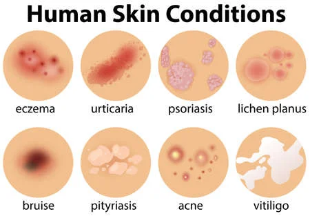

<div align ='center'>
  
# 18CSC305J - AI
### Domain : Machine Learning / AI
  
  </div>
  


### Problem Statement 
Build Mathematical model using ML and signal processing concept to process the skin issues into dryness and oiliness.

### Description
Patients face a lot of problems with their skin. The main issue remains with the type of skin they have. Depending on the type of skin various skin diseases can occur. So if the skin is too dry it may start to peel and lead to various skin diseases like Psoriasis, Eczema etc. likewise too oily skin can lead to pimples which in turn can lead to scars. So the identification of skin type is of utmost need.

## Classes of Skin Diseases



## Frontend


.jpeg)


.jpeg)

.jpeg)


## Tech Stacks

+ Pytorch
+ torchvision
+ Pillow
+ HTML
+ CSS
+ Bootstrap
+ Javascript
+ Flask
+ Werkzeug


## Model Used

### EfficientNet-B0
The EfficientNet-B0 architecture wasn’t developed by engineers but by the neural network itself. This model was developed using a multi-objective neural architecture search that optimizes both accuracy and floating-point operations.

Taking B0 as a baseline model, the authors developed a full family of EfficientNets from B1 to B7 which achieved state of the art accuracy on ImageNet while being very efficient to its competitors.
Below is a table showing the performance of EfficientNets family on ImageNet dataset.


The Efficient-B0 is mobile sized architecture having 11M trainable parameters. This is what the architecture looks like:


The pre-trained imagenet weights were loaded into the model. The first seven layers of the model architecture were frozen and the rest of the layers were trained on the data. The Stochastic Gradient Descent optimizer was used with a learning rate of 0.01 and a momentum of 0.9 . The loss function used was categorical cross entropy. The model achieved an accuracy of <strong>95.5%</strong> on the test data set.


## Running Instructions
Open the terminal and type the following 
```
$ git clone https://github.com/MahimaKhatri/Skin-Care.git
$ cd Skin-Care
$ python3 -m venv skin-class-env
$ source skin-class-env/bin/activate
$ pip3 install -r requirements.txt
$ python3 predict.py -m "Path to torch model" -i "Path to image"
```


